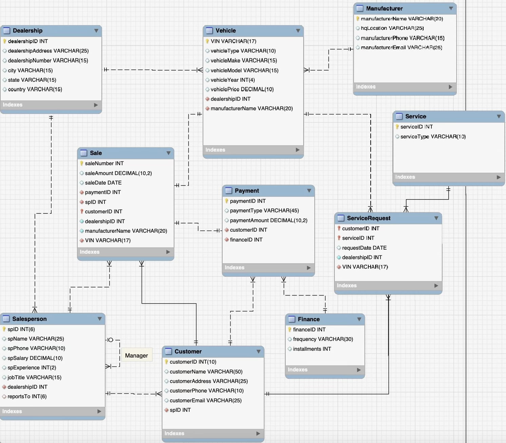
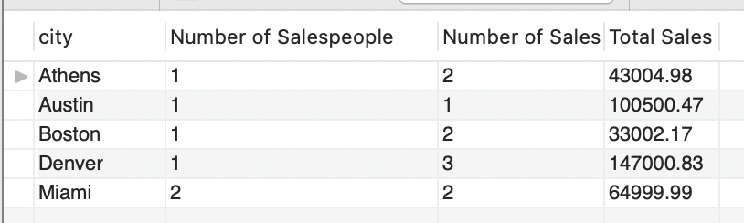

## Project 1 MIST 4610

Team Name: 21482_3

Team Members

- Lily Fitzgerald  [@lilyjfitz](https://github.com/lilyjfitz)
- Pierre Paradis [@pierreparadis](https://github.com/pierreparadis)
- Ethan Delamater  [@ethandelamater](https://github.com/ethandelamater)
- Anders Roth [@AndersRoth](https://github.com/AndersRoth)
- Joseph Fredeman [@Jfredeman](https://github.com/Jfredeman)

## Problem Description
Our team decided to look into the car dealership industry, particularly businesses like Carmax. We chose this because we felt that there is problem in the lack of organization and management between sales, finance, and the service departments within a car dealership. Our team created Data Model to address this problem and showcase the relationships between all aspects of a car dealership. The Data Model comprises different entities that form the car dealership system as a whole, such as sales, payments, service requests, customers, salespeople, vehicles, etc. These entities are interconnected through appropriate relationships and possess detailed attributes within each category. The goal of our project is to make the car dealership process more smooth, facilitate communication between different departments, and improve customer satisfaction experience.

_Improvements_
- Our first improvement is offering any service request at the car dealership at a reduced rate so the customer doesnt feel the need to find a 3rd party business. These service requests can include anything from car matienece to general detailing and cleaning. 
- Another improvement is the incorporation of a personalized salesperson. We have a head manager assuring each saleperson is doing their job well, and each customer will only ever have to deal with one salesperson. Dealing with one and only one trained professional will help reduce the customer stress and make them feel more comfortable in the experience.
## Data Model

Data Model Description:

ONE TO MANY Identifying Relationships:
- A Customer can have multiple Sales but without the customer there are no Sales

ONE TO MANY Relationships:
- A Salesperson has many Sales
- A Salesperson has many Customers
- A Customer has many Payments
- A Dealership has many Sales people
- A Finance has mutiple Payments

ONE TO ONE Relationships:
- Each Sale has has one Payment plan and a Payment plan is attached to one Sale
- A Sale includes one Vehicle and a Vehicle has one sale

MANY TO MANY Relationships:
- Dealership to Manufacturer - A dealership can get vehicles from multiple manufacturers and a manufacturer will sell vehicles to multiple dealerships.
- Customer to Service- a customer can request multiple services, and a service can be requested by multiple customers. 

The Associative tables are Vehicle and Service Request.

RECURSIVE Relationship:
- Manager to Salesperson- A manager can manage multiple Sales people, but a Salesperson only has one Manager. 

🔗 [Data Dictionary](https://docs.google.com/spreadsheets/d/1QlI2LRiLOjDiEhPXp9Ho8GiUAaRuEWVMSRwXiWoqvOo/edit#gid=0)
## Queries
🔗 [Query Matrix](https://docs.google.com/spreadsheets/d/1QlI2LRiLOjDiEhPXp9Ho8GiUAaRuEWVMSRwXiWoqvOo/edit#gid=1446005263)

~ Query 1:

Description: List the different cities of dealerships, count of the number of salespeople in that city, the number of sales that salespeople at that office were sales representatives for, and total sales. 

Justification: A manager would like to know which dealerships are most profitable, as well as the relation between sales and number of salespeople per dealership. It will help them with potential dealership expansions and investment in more profitable dealerships

_Code:_

**SELECT** Dealership.city, **COUNT**(DISTINCT Salesperson.spID) AS "Number of Salespeople", **COUNT**(saleNumber) AS "Number of Sales", SUM(saleAmount) AS "Total Sales"  
**FROM** Dealership  
**JOIN** Salesperson **ON** Dealership.dealershipID = Salesperson.dealershipID  
**JOIN** Sale **ON** Salesperson.spID = Sale.spID  
**GROUP BY** Dealership.city;

_Result:_

~ Query 2:  

Description: A query to display the name of the Salesperson, the amount of business they have generated, and the number of sales they have completed in descending order of total sales if they have generated over a certain amount of sales.

Justification: A manager can see which of his employees are creating the most business for the company and assigning raises to any salesperson who has generated over $40,000 in sales, as well as a bonus for the top earner.

_Code:_

**SELECT** spName, **CONCAT**("$",ROUND (SUM(saleAmount), 2)) **AS** "Total Sales", COUNT(saleNumber) **AS** "Number of Sales"   
**FROM** Salesperson  
**JOIN** Sale **ON** Salesperson.spID = Sale.spID  
**GROUP BY** spName   
**HAVING** SUM(saleAmount) > 40000  
**ORDER BY** SUM(saleAmount) **DESC**;

_Result:_

~ Query 3:

Description: This is a query that will list the percentage of salesmen who have not completed a sale in any of the dealerships and if they have more than the average amount of experience in the job. 

Justification: This will allow for a manager to see what percentage of their workers are not making sales and to disassociate lack of result from the lack of experience. 

_Code:_

**SELECT** **CONCAT**(ROUND(100*(SELECT COUNT(spName) 
FROM Salesperson WHERE NOT EXISTS (SELECT * FROM Customer WHERE Customer.spID = Salesperson.spID) AND spExperience > (SELECT avg(spexperience) FROM Salesperson))/COUNT(*),2),'%') AS 'NoSaleWorkers'  
**FROM** Salesperson;

_Result:_

~ Query 4:

Description:This is a query that lists the cities where the dealerships are located, the average payment amount that each dealership makes per sale, the amount of a typical commission for the average sale, and the average profit each dealership makes per sale.

Justification: This allows for each dealership to be able to see how much of a payment they are receiving on average and who has the highest out of all of the dealerships, how much commission each employee would typically be getting for a sale, and the overall profit for each sale after taking awake the employees commission. This can be used to project overage profitability and how much employees make depending on their amount of sales a year.

_Code:_ 

**SELECT** city, (SUM(paymentAmount)/COUNT(paymentID)) AS "AveragePayment", ((SUM(paymentAmount)/COUNT(Salesperson.spID))*0.25) AS "SalesCommission", ((SUM(paymentAmount)/COUNT(paymentID)*0.75))AS "AverageProfit"  
**FROM** Dealership   
**JOIN** Salesperson ON Dealership.dealershipID = Salesperson.dealershipID   
**JOIN** Customer ON Salesperson.spID = Customer.spID 
**JOIN** Payment ON Customer.customerID = Payment.customerID   
**GROUP BY** city;

_Result:_

~ Query 5:

Description: This is a query that lists the manufacturer name, VIN number, and vehicle year for vehicles that are sedans and modeled between 2014 and 2022 

Justification: This would allow management to keep a catalog of more recently modeled cars for potential customers to browse from if they were interested in purchasing a sedan style vehicle.

_Code:_

**SELECT** Vehicle.VIN, Vehicle.manufacturerName, vehicleYear.    
**FROM** Vehicle      
**JOIN** Manufacturer **ON** Vehicle.manufacturerName=Manufacturer.manufacturerName   
**WHERE** vehicleType = 'sedan' **AND** vehicleYear BETWEEN 2014 **AND** 2022;

_Result:_

- Query 6:
- Query 7:
- Query 8:
- Query 9:
- Query 10:
## Database Information
